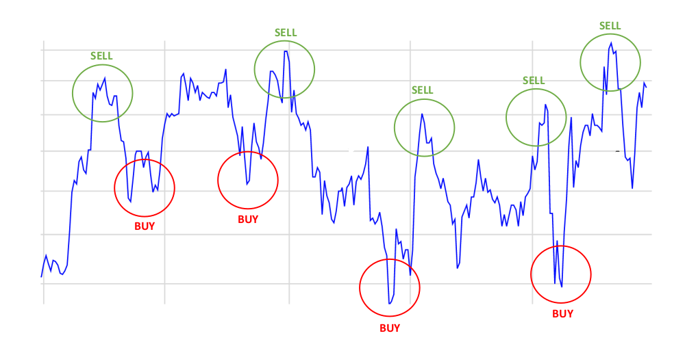
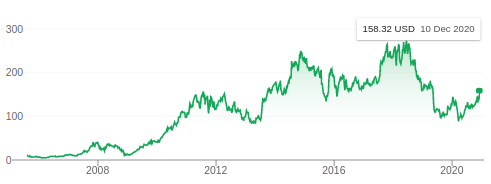
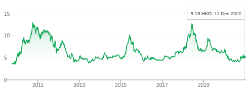
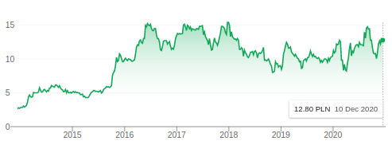
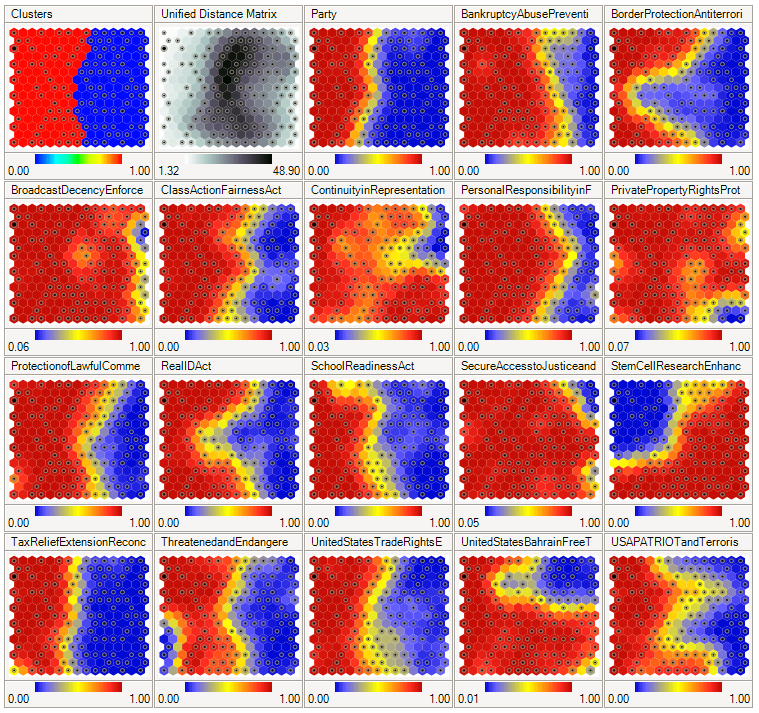

# Investment Strategy With Self Organizing Kohonens Maps

### Aim of The Project
The purpose of the following work is to create an investment strategy operating on the historical data from the Polish stock exchange. Such a system may support decisions making by the human during investments on a stock market. 

The following problem will be solved by the usage of unsupervised clustering algorithm bases on the neural networks - **Self-organizing Kohonen Maps**. Its adventage comparing to the supervised algorithms, is that the unsupervised learning may provide better results, as no action is defined for the particular situation on the market. Instead, the most similar configurations of shares’ prices may be identified and labeled.

### System Description
Because the nature of each stock market's company is different, it is not possible to build a single model for all of them. Therefore, the separate model will be trained for each company, as the particular enterprise is unique and its behavior in time does not depend on the other companies.

The whole process consistes of two main phases which are: **data preparation** and **modeling**. During the first phase a set of parameters describing a company will be created in a form of timeseries dataset. Those parameters will be callculated from the available coefficients described in the next section. In the next phase, which is modeling, the similar groups of vectors (**clusters**) will be created, basing on dataset features in particular timestamp. Then, each cluster will be marked as **'buy'**, **'sell'** or **'hold'**. The labels will be assigned to the clusters according to their mean return value. At the picture bellow we can see a good moments for selling or buying a stock:

According to the tresholds due to which we set clusters labels, a strategy can be more or less agresive. Tresholds don't need to be symetric as they reflect the
character of the investor and his inclination towards taking the risk.

### Data
To make our model working correctly we need to operate on the stocks which has significant fluctuations in their prices. In an opposite case, it is highly probable that we would mark every moment in the timeseries as 'hold'.

The example companies which has been chosen comes from stock exchanges like: HKG (Hong-Kong), NASDAQ (USA) and WSE (Polish). The market summary of each company can be seen at the pictures above:

#### NASDAQ: BIDU

#### HKG: 1234

#### WSE: PSW

### Self-Organizing Maps
The self-organizing map (SOM) is an automatic data-analysis method. It is widely applied to clustering problems and data exploration in industry, finance, natural sciences, and linguistics. The SOM is related to the classical vector quantization (VQ), which is used extensively in digital signal processing and transmission. Like in VQ, the SOM represents a distribution of input data items using a finite set of models. In the SOM, however, these models are automatically associated with the nodes of a regular (usually two-dimensional) grid in an orderly fashion such that more similar models become automatically associated with nodes that are adjacent in the grid, whereas less similar models are situated farther away from each other in the grid. This organization, a kind of similarity diagram of the models, makes it possible to obtain an insight into the topographic relationships of data, especially of high-dimensional data items. If the data items belong to certain predetermined classes, the models (and the nodes) can be calibrated according to these classes. An unknown input item is then classified according to that node, the model of which is most similar with it in some metric used in the construction of the SOM.

### Dataset Attributes

